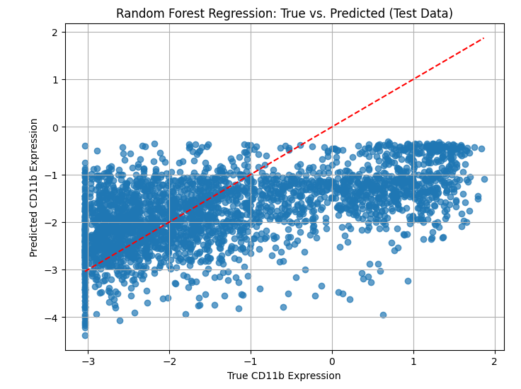
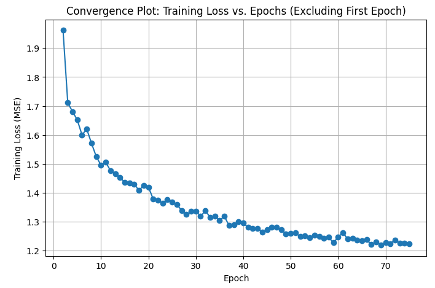

# Protein Expression Prediction from Histology Image Features

Machine learning project predicting protein expression levels from biological tissue image patches using image feature engineering, classical regression models and PyTorch neural networks.

This project was completed as part of the **Data Mining** module during my MSc Data Analytics at the University of Warwick. The task was to predict protein expression values from tissue image patches, with a focus on both single-target regression for **CD11b** and multi-output prediction across **38 proteins**.

---

## Project Overview

The dataset consists of biological tissue image patches taken from four specimens:

```text
A1, B1, C1, D1
```

Each image patch corresponds to a spatial location in a tissue specimen and has associated expression values for 38 proteins.

The core machine learning objective was:

> Given a biological tissue image patch, predict the corresponding protein expression level.

The project explores whether visual information from histology-style image patches can be used to infer underlying biological marker expression.

---

## Repository Contents

```text
protein-expression-prediction/
│
├── README.md
├── protein_expression_prediction.ipynb
├── cd11b_true_vs_pred_rf.png
└── training_loss_nn.png
```

### Files

| File                                  | Description                                                                                                                          |
| ------------------------------------- | ------------------------------------------------------------------------------------------------------------------------------------ |
| `protein_expression_prediction.ipynb` | Main notebook containing exploratory analysis, feature extraction, classical regression models, neural network models and evaluation |
| `cd11b_true_vs_pred_rf.png`           | True vs predicted CD11b expression plot for the best-performing Random Forest model                                                  |
| `training_loss_nn.png`                | Neural network training loss curve showing model convergence                                                                         |
| `README.md`                           | Project overview, methodology, results and setup instructions                                                                        |

---

## Dataset

The raw dataset is not included in this repository.

The original coursework dataset contained image patches from four biological tissue specimens and corresponding expression values for 38 proteins. The data was provided as part of the university module, so the repository only includes the modelling notebook and selected output figures.

Expected local structure if reproducing the notebook:

```text
data/
├── expression_data.csv
└── image_patches/
    ├── A1_...
    ├── B1_...
    ├── C1_...
    └── D1_...
```

The notebook may require path updates depending on where the dataset is stored locally.

---

## Machine Learning Tasks

The project was split into three main stages:

1. Exploratory data analysis and image preprocessing
2. Single-target regression for CD11b expression
3. Multi-output neural network prediction for all proteins

---

## 1. Exploratory Data Analysis

The initial analysis investigated:

* Number of image patches per specimen
* CD11b expression distributions across specimens
* RGB image channel statistics
* HED colour-space transformations
* Correlations between image intensity features and CD11b expression
* Correlations between different protein expression values

A key observation was that protein expression distributions varied noticeably between specimens. This made the problem more realistic and challenging because the model needed to generalise to unseen biological specimens rather than simply memorising within-specimen patterns.

---

## 2. Image Preprocessing and Feature Engineering

Each image patch was processed to extract meaningful numerical features.

### RGB Features

For each image, I extracted summary statistics from the original colour channels:

* Red channel mean and variance
* Green channel mean and variance
* Blue channel mean and variance

### HED Colour-Space Features

Images were also transformed from RGB into HED colour space:

* Hematoxylin channel
* Eosin channel
* DAB channel

For each HED channel, I extracted mean and variance statistics.

This was useful because HED colour space is commonly used for histology-style images and can help separate staining-related visual information.

### PCA Features

In addition to handcrafted channel statistics, resized image patches were flattened and transformed using PCA to capture broader visual structure while reducing dimensionality.

The final classical feature representation combined:

```text
RGB channel statistics + HED channel statistics + PCA image features
```

---

## 3. CD11b Single-Target Prediction

The first modelling task focused on predicting the expression level of **CD11b**.

Training specimens:

```text
B1, C1, D1
```

Held-out test specimen:

```text
A1
```

This setup tested whether the model could generalise to an unseen specimen.

### Models Compared

The following models were evaluated:

* Ordinary Least Squares Regression
* Random Forest Regression
* PyTorch Neural Network

### Evaluation Metrics

The models were assessed using:

* RMSE
* Pearson correlation
* Spearman correlation
* R² score

RMSE was treated as the primary error metric because it is directly interpretable in the target expression scale and penalises large errors more strongly.

---

## CD11b Results

| Model                  |   RMSE | Pearson | Spearman |      R² |
| ---------------------- | -----: | ------: | -------: | ------: |
| Ordinary Least Squares | 1.5821 |  0.4522 |   0.5178 | -0.2136 |
| Random Forest          | 1.2902 |  0.5533 |   0.5582 |  0.1930 |
| Neural Network         | 1.4105 |  0.4473 |   0.4620 |  0.0355 |

The **Random Forest model performed best overall**, achieving the lowest RMSE and strongest correlation scores on the held-out A1 specimen.

This suggests that the relationship between image-derived features and CD11b expression was non-linear, and that Random Forest regression was better suited to the available feature representation than a simple linear model.

---

## Best Model: Random Forest

The Random Forest model achieved the strongest CD11b prediction performance.



The true vs predicted plot shows that the model captured some useful signal from the image-derived features, although there was still substantial uncertainty due to specimen-level distribution shift and the difficulty of predicting biological expression values from image patches alone.

---

## 4. Neural Network Model

A feed-forward neural network was implemented in PyTorch to predict CD11b expression.

The neural network was trained using image-derived features and evaluated on the held-out A1 specimen.



The training loss curve shows that the neural network learned from the training data, but its final test performance did not exceed the Random Forest model. This suggests that, for this feature representation and dataset size, the Random Forest provided better generalisation.

---

## 5. Multi-Protein Prediction

The project was extended from single-target CD11b prediction to simultaneous prediction of all **38 protein expression values**.

A multi-output PyTorch neural network was trained and evaluated using leave-one-specimen-out cross-validation.

### Leave-One-Specimen-Out Cross-Validation

The validation strategy was:

```text
Fold 1: train on B1, C1, D1 → test on A1
Fold 2: train on A1, C1, D1 → test on B1
Fold 3: train on A1, B1, D1 → test on C1
Fold 4: train on A1, B1, C1 → test on D1
```

This is a stricter validation approach than a random train-test split because each test set contains an entirely unseen biological specimen.

### Multi-Protein Result Summary

For the multi-output task, model performance was reported for each protein using:

* Average RMSE across folds
* Standard deviation of RMSE across folds
* Average Pearson correlation across folds
* Average Spearman correlation across folds
* Average R² score across folds

In the final evaluation, **0 proteins achieved an average Spearman correlation above 0.7**, highlighting the difficulty of robustly predicting protein expression across unseen specimens.

---

## Additional Analysis: Spatial Features

The dataset also contained location information for tissue spots.

I tested whether adding spatial location features improved CD11b prediction. The results showed that location features did not improve performance for the tested models.

### OLS Without vs With Location Features

| Model                |   RMSE | Pearson | Spearman |      R² |
| -------------------- | -----: | ------: | -------: | ------: |
| OLS without location | 1.5821 |  0.4522 |   0.5178 | -0.2136 |
| OLS with location    | 1.5889 |  0.4531 |   0.5200 | -0.2240 |

### Random Forest Without vs With Location Features

| Model                          |   RMSE | Pearson | Spearman |     R² |
| ------------------------------ | -----: | ------: | -------: | -----: |
| Random Forest without location | 1.2949 |  0.5483 |   0.5547 | 0.1870 |
| Random Forest with location    | 1.3268 |  0.5232 |   0.5307 | 0.1465 |

Adding location features slightly worsened Random Forest performance, suggesting that the spatial coordinates did not provide useful additional predictive signal in this setup.

---

## Key Observations

* CD11b expression varied across specimens, making cross-specimen generalisation challenging.
* Simple average channel intensities showed limited direct correlation with CD11b expression.
* Combining RGB/HED statistics with PCA features produced a more useful feature representation.
* Random Forest regression outperformed OLS and the PyTorch neural network for CD11b prediction.
* Neural networks learned the training data but did not generalise as well as Random Forest in the single-target setting.
* Multi-protein prediction was significantly harder than single-target CD11b prediction.
* Leave-one-specimen-out validation revealed the difficulty of generalising to unseen biological specimens.
* Adding spot location features did not improve performance in the tested models.

---

## Technical Stack

* Python
* NumPy
* Pandas
* Matplotlib
* SciPy
* scikit-learn
* scikit-image
* PyTorch
* Jupyter Notebook

---

## How to Run

Clone the repository:

```bash
git clone https://github.com/abdullah12353/protein-expression-prediction.git
cd protein-expression-prediction
```

Install dependencies:

```bash
pip install numpy pandas matplotlib scipy scikit-learn scikit-image torch jupyter
```

Launch the notebook:

```bash
jupyter notebook protein_expression_prediction.ipynb
```

Make sure the dataset is available locally and update the notebook paths if required.

---

## Skills Demonstrated

This project demonstrates:

* Image preprocessing for machine learning
* Feature engineering from biological image patches
* RGB and HED colour-space analysis
* PCA-based dimensionality reduction
* Regression model development and evaluation
* Random Forest model tuning
* PyTorch neural network implementation
* Multi-output regression
* Leave-one-group-out cross-validation
* Careful evaluation under specimen-level distribution shift

---

## Future Improvements

Potential extensions include:

* Training a CNN directly on image patches instead of handcrafted features
* Using transfer learning from pretrained computer vision models
* Applying stain normalisation to reduce specimen-level distribution shift
* Improving neural network regularisation with dropout and weight decay
* Using graph-based spatial features based on neighbouring tissue spots
* Testing more robust validation strategies across biological specimens
* Investigating partial correlations to check whether CD11b prediction is independent of correlated protein expression signals

---

## Project Status

Completed coursework project, cleaned and uploaded for portfolio purposes.

This repository is intended to demonstrate applied machine learning, image-based regression, feature engineering, PyTorch experimentation and careful model evaluation.
